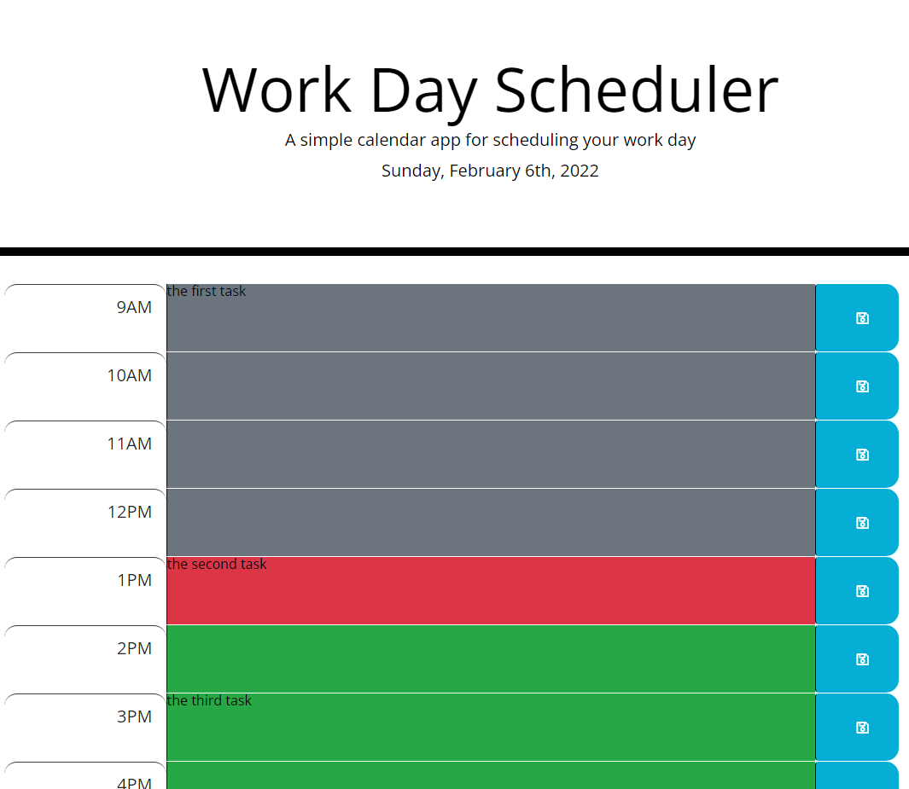

# Third-Party APIs Challenge: Work Day Scheduler

## Description

```
Client requested that functionality be implemented to create a daily planner. This is being done to assist with tracking important events by adding them to the planner. This planner now functions so it will allow the client to add events each hour of the work day, and the events will persist through localStorage.
```

## User Story

```
AS AN employee with a busy schedule
I WANT to add important events to a daily planner
SO THAT I can manage my time effectively
```

## Acceptance Criteria

```
- It is done when a user opens the planner and the current day is displayed at the top of the planner.
- It is done when a user scrolls down the page and sees time blocks each standard business hour (9 AM to 5 PM).
- It is done when a user can see if each time block has already been passed in the current day, if the time block is current, or if the time block is upcoming based on what color they appear as.
- It is done when a user can click into a time block to enter text for an event or reminder.
- It is done when a user clicks the save button for each time block and that data is saved to localStorage.
- It is done when a user refreshes the page, and the previously saved data persists.
```

The following image demonstrates the application functionality:



## Review

You are required to submit the following for review:

- The URL of the deployed application: https://sstover25.github.io/The_Amazing_Password_Generator/

- The URL of the GitHub repository: https://github.com/sstover25/The_Amazing_Password_Generator

---

## Credits

```
Coding assistance from KU bootcamp modules, https://www.w3schools.com, https://developer.mozilla.org/, and Stack Overflow.

```

© 2021 Trilogy Education Services, LLC, a 2U, Inc. brand. Confidential and Proprietary. All Rights Reserved.
